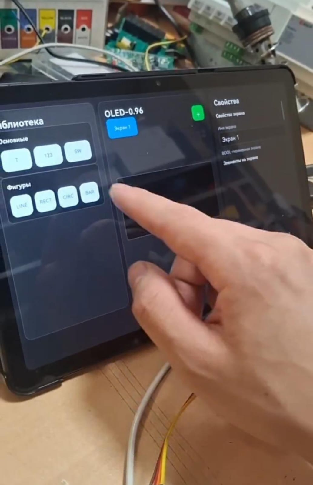
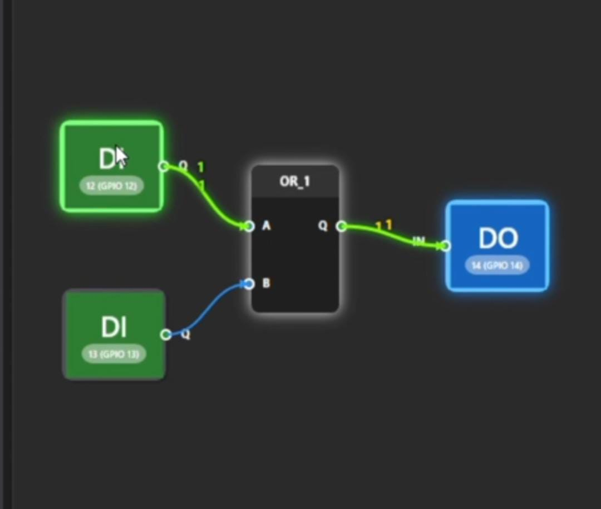

<div align="center">

### Tim Pengembang

**Evelly Khanzania Putri**  
**Raykenzie Nazaru Fathurrahmansyah**  
**Dhiyaa Fazila Nugraha**

**SMKN 1 JAKARTA**

</div>

---

# IOTERA

## IoT Engineering & Recommendation Assistant

> Platform berbasis web yang membantu pengguna menerjemahkan ide menjadi rancangan awal proyek Internet of Things (IoT) berbentuk prototype 3D yang interaktif.

IOTERA mengintegrasikan **Artificial Intelligence (AI)**, **Machine Learning Recommendation**, **Speech Recognition**, **Component Library**, dan **visualisasi 3D** dalam satu alur perancangan. Pengguna cukup menyampaikan gagasan melalui teks atau suara; sistem kemudian menganalisis kebutuhan proyek, merekomendasikan komponen, menyusun rancangan awal, dan menampilkannya dalam lingkungan 3D yang dapat dimodifikasi.

IOTERA bukan sekadar chatbot atau simulator. Platform ini berperan sebagai **asisten engineering pada tahap awal**, sekaligus menjadi jembatan antara aspirasi pengguna, rekomendasi teknis, dan pengembangan prototype IoT nyata.

---

## Daftar Isi

- [Latar Belakang](#latar-belakang)
- [Rumusan Masalah](#rumusan-masalah)
- [Tujuan](#tujuan)
- [Sasaran Pengguna](#sasaran-pengguna)
- [Fungsi IOTERA](#fungsi-iotera)
- [Konsep dan Cara Kerja](#konsep-dan-cara-kerja)
- [Fitur Utama](#fitur-utama)
- [Teknologi dan Tools](#teknologi-dan-tools)
- [Component Library](#component-library)
- [User Flow](#user-flow)
- [Metode Penelitian](#metode-penelitian)
- [Pengujian Sistem](#pengujian-sistem)
- [Pembahasan](#pembahasan)
- [Keunggulan dan Kontribusi AI](#keunggulan-dan-kontribusi-ai)
- [Manfaat dan Dampak](#manfaat-dan-dampak)
- [Keterkaitan dengan SDGs](#keterkaitan-dengan-sdgs)
- [Referensi dan Inspirasi](#referensi-dan-inspirasi)
- [Daftar Pustaka](#daftar-pustaka)

---

## Latar Belakang

Perkembangan teknologi digital membuka peluang besar bagi manusia untuk memperoleh informasi, meningkatkan kemampuan, dan mengembangkan gagasan. Dalam pendidikan, pemanfaatan teknologi digital juga dapat memberikan pengalaman belajar yang lebih efektif. Akan tetapi, kemudahan memperoleh informasi belum sepenuhnya menyelesaikan kesulitan dalam menerjemahkan ide menjadi rancangan teknologi yang dapat dipahami dan diwujudkan.

Permasalahan tersebut sangat terasa dalam pengembangan proyek IoT. Seseorang mungkin memiliki gagasan inovatif, tetapi belum memahami cara menentukan mikrokontroler, sensor, aktuator, koneksi antar-komponen, dan arsitektur sistem. AI dapat membantu memberikan rekomendasi, tetapi keluarannya umumnya masih berupa teks yang harus diterjemahkan kembali oleh pengguna menjadi rancangan teknis.

IOTERA dikembangkan untuk menutup kesenjangan tersebut. Hasil analisis AI tidak berhenti sebagai jawaban tekstual, tetapi diubah menjadi data terstruktur dan divisualisasikan sebagai prototype IoT 3D. Melalui pendekatan **human-in-the-loop**, rancangan AI menjadi titik awal yang tetap dapat diperiksa, diubah, dan dikembangkan oleh pengguna.

---

## Rumusan Masalah

1. Bagaimana mengembangkan platform web untuk menyampaikan ide proyek IoT melalui teks dan suara?
2. Bagaimana menggunakan AI dan Machine Learning Recommendation untuk menganalisis ide serta merekomendasikan komponen IoT yang sesuai?
3. Bagaimana mengubah hasil rekomendasi menjadi prototype 3D interaktif, bukan sekadar keluaran teks?
4. Bagaimana menyediakan fitur untuk menambah, menghapus, mengatur, dan menghubungkan komponen pada rancangan 3D?
5. Bagaimana menjembatani aspirasi pengguna dengan rancangan teknis awal yang dapat dikembangkan menuju prototype nyata?

---

## Tujuan

### Tujuan umum

Mengembangkan platform berbasis web yang memanfaatkan AI, sistem rekomendasi, pengenalan suara, dan visualisasi 3D untuk membantu pengguna menerjemahkan gagasan menjadi rancangan awal proyek IoT yang interaktif.

### Tujuan khusus

- Menyediakan input ide melalui teks dan suara.
- Mengidentifikasi tujuan, fungsi, dan kebutuhan teknis proyek dengan AI.
- Merekomendasikan mikrokontroler, sensor, aktuator, dan komponen pendukung.
- Mengubah rekomendasi menjadi prototype IoT 3D.
- Menyediakan workspace untuk melihat dan mengedit rancangan secara interaktif.
- Memungkinkan pengguna menambahkan komponen dan kabel jumper.
- Melakukan validasi dasar atas pin, tegangan, koneksi, dan kompatibilitas komponen.
- Menghasilkan rancangan awal yang dapat menjadi acuan pengembangan prototype fisik.

---

## Sasaran Pengguna

Sasaran utama IOTERA adalah **pelajar, mahasiswa, pemula, dan inovator muda** yang memiliki gagasan proyek IoT tetapi mengalami keterbatasan dalam menerjemahkannya menjadi rancangan teknis.

---

## Fungsi IOTERA

IOTERA memiliki fungsi utama sebagai **asisten engineering berbasis AI** pada tahap awal perancangan proyek IoT. Fungsi tersebut dijabarkan sebagai berikut:

| Fungsi | Penjelasan |
| :--- | :--- |
| Penerimaan aspirasi | Menerima ide dan kebutuhan pengguna melalui teks maupun suara. |
| Penerjemahan ide | Mengubah bahasa sehari-hari pengguna menjadi kebutuhan teknis proyek IoT. |
| Identifikasi kebutuhan | Menentukan tujuan, fungsi, kebutuhan komunikasi, sensor, aktuator, dan mikrokontroler. |
| Rekomendasi komponen | Memilih komponen yang sesuai dan tersedia di dalam Component Library. |
| Penyusunan blueprint | Membentuk data terstruktur mengenai komponen dan arsitektur awal sistem. |
| Visualisasi rancangan | Menampilkan hasil analisis sebagai prototype IoT digital dalam lingkungan 3D. |
| Pengembangan interaktif | Memungkinkan pengguna menambah, menghapus, memindahkan, dan memutar komponen. |
| Perancangan koneksi | Memungkinkan pengguna menghubungkan pin melalui fitur Add Jumper. |
| Validasi dasar | Memberikan peringatan terkait tegangan, GPIO, jenis pin, konflik, dan kompatibilitas koneksi. |
| Pengelolaan proyek | Menyimpan, membuka kembali, melanjutkan, dan mengekspor rancangan pengguna. |
| Media pembelajaran | Membantu pengguna memahami fungsi komponen dan struktur dasar proyek IoT secara visual. |

---

## Konsep dan Cara Kerja

Alur utama IOTERA dapat diringkas sebagai berikut:

```text
Teks / Suara
     ↓
Speech Recognition
     ↓
Analisis AI dan Identifikasi Kebutuhan
     ↓
Machine Learning Recommendation
     ↓
Rekomendasi Komponen dari Component Library
     ↓
Data Rancangan Terstruktur
     ↓
Prototype dan Visualisasi 3D
     ↓
Edit Komponen + Tambah Jumper + Validasi
     ↓
Simpan / Ekspor Proyek
```

Contoh sederhana:

```text
“Saya ingin membuat penyiram tanaman otomatis”
                         ↓
                    Analisis AI
                         ↓
ESP32 + Soil Moisture Sensor + Relay + Water Pump
                         ↓
                   Prototype IoT 3D
```

### Flowchart sistem


Flowchart tersebut memperlihatkan proses sejak pengguna memasukkan kebutuhan proyek, pemilihan input teks atau suara, analisis dan rekomendasi, validasi kelayakan rancangan, hingga penyajian prototype 3D dan informasi proyek pada dashboard.

---

## Fitur Utama

| Fitur | Fungsi |
| :--- | :--- |
| **Text Input** | Menerima aspirasi dan kebutuhan proyek dalam bentuk teks. |
| **Voice Input** | Menerima ide melalui suara dan mengubahnya menjadi teks dengan Speech Recognition. |
| **AI Analysis** | Memahami tujuan, fungsi, dan kebutuhan teknis dari ide pengguna. |
| **Component Recommendation** | Merekomendasikan mikrokontroler, sensor, aktuator, dan komponen pendukung. |
| **3D Workspace** | Menampilkan serta memungkinkan eksplorasi rancangan melalui zoom, rotate, dan perpindahan sudut pandang. |
| **Add Component** | Menambah komponen dari Component Library ke dalam workspace. |
| **Edit Component** | Memindahkan, memutar, mengatur posisi, atau menghapus komponen. |
| **Add Jumper** | Membuat hubungan antar-pin komponen secara visual. |
| **Validation** | Memeriksa kompatibilitas, tegangan, GPIO, jenis pin, dan konflik koneksi dasar. |
| **Project Dashboard** | Membuat, membuka, mengedit, menyimpan, dan menghapus proyek. |
| **Project Information** | Menampilkan tujuan, arsitektur, daftar komponen, fungsi, dan hubungan antar-komponen. |
| **Export Project** | Mengekspor model, daftar komponen, koneksi, dan dokumentasi rancangan. |

---

## Teknologi dan Tools

| Bagian | Teknologi | Peran |
| :--- | :--- | :--- |
| Frontend | React.js | Membangun dashboard, halaman proyek, Component Library, AI Idea Input, dan 3D Workspace. |
| Build tool | Vite | Mendukung proses pengembangan dan build aplikasi React. |
| Runtime/backend | Node.js | Menjalankan layanan JavaScript serta integrasi AI, basis data, dan layanan lain. |
| Bahasa | JavaScript / TypeScript | Mengelola logika aplikasi, data proyek, integrasi AI, dan interaksi 3D. |
| Antarmuka | JSX/TSX, HTML, CSS | Menyusun komponen, struktur halaman, layout, desain, dan responsivitas. |
| Rendering 3D | Three.js | Merender objek dan lingkungan 3D berbasis WebGL di browser. |
| Integrasi React–3D | React Three Fiber | Mengelola objek Three.js sebagai komponen React. |
| Helper 3D | Drei | Menyediakan camera control, environment, pemuatan model, dan helper interaksi. |
| Model CAD | 3D ContentCentral | Menjadi salah satu sumber model komponen IoT. |
| Format aset | STEP → GLB/GLTF | Mengubah model CAD menjadi aset yang sesuai untuk rendering web. |
| Speech Recognition | Whisper / Vosk | Mengubah input suara pengguna menjadi teks. |

### Pengolahan model 3D

Model tidak diambil langsung dari platform sumber setiap kali pengguna membuat proyek. Model dipilih dan dikurasi terlebih dahulu melalui alur berikut:

```text
3D ContentCentral
       ↓
Pencarian dan Pemilihan Model
       ↓
Unduh STEP (.step/.stp)
       ↓
Konversi ke GLB/GLTF
       ↓
Optimasi Skala, Orientasi, Geometri, dan Ukuran
       ↓
3D Component Library IOTERA
       ↓
Rendering melalui React Three Fiber
```

Setelah tersimpan di library, hasil rekomendasi AI cukup dicocokkan dengan ID komponen dan berkas GLB yang tersedia.

---

## Component Library

| Kategori | Contoh Komponen |
| :--- | :--- |
| **Microcontroller** | ESP32, ESP32-CAM, Arduino Uno, Arduino Nano |
| **Sensor** | DHT22, HC-SR04, Soil Moisture Sensor, PIR, LDR, MQ-135, RFID RC522, Load Cell |
| **Actuator** | Servo Motor, Relay, Water Pump, DC Motor, Buzzer, LED |
| **Connection** | Jumper Male–Male, Male–Female, Female–Female |

Setiap entri library dapat memuat nama, ID, kategori, fungsi, tegangan kerja, informasi pin, kompatibilitas, deskripsi, dan model 3D. Pembatasan rekomendasi pada komponen yang tersedia membuat hasil AI dapat langsung dipetakan ke aset visual yang valid.

Contoh struktur data komponen:

```yaml
id: MCU001
name: ESP32
category: Microcontroller
model: esp32.glb
voltage: 3.3V
wifi: true
bluetooth: true
pin_data: available
```

---

## User Flow


| Tahap | Proses | Penjelasan |
| :---: | :--- | :--- |
| 1 | Akses IOTERA | Pengguna membuka website IOTERA untuk memulai perancangan proyek IoT. |
| 2 | Register / Login | Pengguna membuat akun atau masuk menggunakan akun yang telah terdaftar. |
| 3 | Dashboard | Pengguna melihat proyek yang tersimpan atau membuat proyek baru. |
| 4 | Create New Project | Pengguna membuat proyek dan mulai menyampaikan kebutuhan yang ingin dikembangkan. |
| 5 | Text Input | Pengguna menyampaikan ide proyek IoT dalam bentuk teks. |
| 6 | Voice Input | Pengguna menyampaikan ide melalui suara yang dikonversi menjadi teks. |
| 7 | AI Analysis | AI memahami tujuan, fungsi, dan kebutuhan proyek pengguna. |
| 8 | Component Recommendation | Sistem merekomendasikan mikrokontroler, sensor, aktuator, dan komponen pendukung. |
| 9 | Generate Prototype 3D | Sistem mengubah rekomendasi menjadi rancangan awal IoT berbentuk prototype digital 3D. |
| 10 | 3D Workspace | Pengguna melihat, memutar, memperbesar, dan mengeksplorasi rancangan. |
| 11 | Add Component | Pengguna menambahkan komponen lain dari Component Library. |
| 12 | Add Jumper | Pengguna menghubungkan pin komponen menggunakan kabel jumper secara visual. |
| 13 | Edit Component | Pengguna memindahkan, memutar, mengatur posisi, atau menghapus komponen. |
| 14 | Validate Project | Sistem melakukan validasi dasar terhadap kompatibilitas komponen dan koneksi. |
| 15 | Revision | Pengguna mengubah kembali prototype apabila rancangan belum sesuai. |
| 16 | Save Project | Rancangan disimpan agar dapat dibuka dan dikembangkan kembali. |
| 17 | Project Information | Sistem menampilkan arsitektur, daftar komponen, koneksi, dan fungsi komponen. |
| 18 | Export Project | Pengguna mengekspor model dan dokumentasi hasil perancangan. |
| 19 | Final Prototype | Pengguna memperoleh rancangan awal IoT 3D sebagai acuan pengembangan prototype fisik. |

---

## Metode Penelitian

Penelitian menggunakan metode **Research and Development (R&D)** dengan pendekatan **Prototype Development**. Metode ini sesuai karena pengembangan dilakukan secara bertahap, diuji, dievaluasi, dan disempurnakan berdasarkan kebutuhan pengguna.

| Tahap | Aktivitas Utama | Hasil yang Diharapkan |
| :---: | :--- | :--- |
| 1 | Identifikasi masalah dan analisis kebutuhan | Daftar kebutuhan input, AI, rekomendasi, library, 3D, editing, dan penyimpanan. |
| 2 | Perancangan sistem | Alur kerja, struktur antarmuka, basis data komponen, dan integrasi AI–3D. |
| 3 | Pengembangan prototype | Aplikasi web, Component Library, serta lingkungan visualisasi 3D awal. |
| 4 | Implementasi AI dan Speech Recognition | Input suara menjadi teks dan ide menjadi data rekomendasi terstruktur. |
| 5 | Implementasi 3D Workspace | Model dapat dilihat, dipindahkan, ditambah, dihapus, dan dihubungkan. |
| 6 | Pengujian sistem | Bukti fungsi utama berjalan serta penilaian pengalaman pengguna. |
| 7 | Evaluasi dan penyempurnaan | Perbaikan antarmuka, rekomendasi, library, visualisasi, dan interaksi. |

### Metode pengumpulan data

- **Studi literatur:** mempelajari sumber mengenai AI, IoT, sistem rekomendasi, Speech Recognition, visualisasi 3D, dan aplikasi web.
- **Observasi:** mengidentifikasi kesulitan serta kebutuhan pengguna saat menerjemahkan ide menjadi rancangan IoT.
- **Kuesioner:** mengukur kemudahan penggunaan, kebermanfaatan, pemahaman visualisasi, dan kemampuan sistem dalam membantu pengembangan gagasan.

### Alur penelitian

```text
Identifikasi Masalah → Studi Literatur → Analisis Kebutuhan
→ Perancangan Sistem → Pengembangan Prototype IOTERA
→ Implementasi AI & Speech Recognition → Implementasi 3D Workspace
→ Pengujian → Evaluasi → Penyempurnaan → Hasil Akhir IOTERA
```

---

## Pengujian Sistem

Prototype diuji menggunakan **Black Box Testing** pada fungsi utama berikut:

| Area Uji | Fokus Pengujian |
| :--- | :--- |
| Input | Penerimaan ide melalui teks dan suara. |
| AI dan rekomendasi | Analisis kebutuhan serta pemilihan komponen. |
| Model 3D | Pemanggilan, pemuatan, dan visualisasi aset. |
| Editing | Add Component, Add Jumper, pengaturan, dan penghapusan komponen. |
| Validasi | Pemeriksaan dasar koneksi dan kompatibilitas. |
| Penyimpanan | Penyimpanan dan pembukaan kembali data proyek. |

Pengujian pengguna dilakukan dengan meminta responden membuat rancangan awal proyek IoT, kemudian menilai kemudahan penggunaan, kejelasan rekomendasi, manfaat visualisasi 3D, dan kemampuan sistem membantu menuangkan ide.

---

## Pembahasan

IOTERA dirancang untuk menangani kesenjangan antara **ide pengguna** dan **rancangan teknis IoT**. Pengguna pemula sering mengetahui masalah yang ingin diselesaikan, tetapi belum mengetahui komponen, koneksi, dan arsitektur yang diperlukan. Karena itu, sistem menempatkan AI pada tahap analisis awal untuk memahami aspirasi dan menyusunnya menjadi rekomendasi teknis terstruktur.

Hasil rekomendasi dibatasi oleh Component Library IOTERA. Pendekatan ini membuat setiap komponen yang direkomendasikan dapat dipetakan ke informasi pin, tegangan, kompatibilitas, dan model 3D yang benar-benar tersedia. Data terstruktur tersebut kemudian menjadi penghubung antara analisis AI dan pemanggilan aset GLB/GLTF pada 3D Workspace.

Visualisasi 3D membuat rancangan lebih konkret daripada keluaran teks biasa. Pengguna dapat mengamati posisi dan hubungan komponen, lalu mengembangkan rancangan melalui Add Component, Add Jumper, pemindahan, rotasi, dan penghapusan komponen. Validasi dasar membantu mengurangi kesalahan awal sebelum rancangan digunakan sebagai acuan pembuatan prototype fisik.

Pendekatan **human-in-the-loop** memastikan bahwa AI tidak mengambil alih keputusan pengguna. AI menghasilkan titik awal berdasarkan kebutuhan yang dianalisis, sedangkan pengguna tetap menentukan perubahan dan bentuk akhir rancangan. Dengan demikian, IOTERA berfungsi sebagai penghubung antara aspirasi, proses pembelajaran, perancangan teknis, dan persiapan implementasi nyata.

IOTERA juga tidak dimaksudkan untuk menggantikan simulator seperti Wokwi atau Tinkercad. Platform ini melengkapi tahap sebelum simulasi: membantu pengguna menemukan kebutuhan proyek dan membentuk blueprint visual yang selanjutnya dapat dikembangkan, disimulasikan, atau diwujudkan secara fisik.

---

## Keunggulan dan Kontribusi AI

### Keunggulan IOTERA

- Mengubah ide menjadi prototype 3D, bukan hanya jawaban teks.
- Mendukung penyampaian aspirasi melalui teks dan suara.
- Memberikan rekomendasi komponen secara otomatis.
- Menyediakan workspace 3D yang interaktif dan fleksibel.
- Memudahkan pemula memahami struktur dasar proyek IoT.
- Mempertahankan kendali pengguna melalui pendekatan human–AI collaboration.

### Kontribusi AI

| Kontribusi | Implementasi dalam IOTERA |
| :--- | :--- |
| Memahami aspirasi | Menganalisis teks atau transkripsi suara pengguna. |
| Mengidentifikasi kebutuhan | Menentukan tujuan, fungsi, komunikasi, sensor, dan aktuator yang diperlukan. |
| Merekomendasikan komponen | Memilih komponen yang kompatibel dari library yang tersedia. |
| Membentuk struktur rancangan | Menghasilkan data terstruktur untuk pembentukan proyek. |
| Menghubungkan ide dengan 3D | Memetakan rekomendasi ke ID dan model GLB komponen. |
| Mendukung pengembangan | Memberikan rancangan awal yang dapat diedit pengguna. |

---

## Manfaat dan Dampak

| Bidang | Manfaat dan Dampak |
| :--- | :--- |
| Pengguna | Mempermudah penyampaian ide melalui teks atau suara tanpa mengharuskan penguasaan istilah teknis secara mendalam. |
| Pemahaman rancangan | Memberikan gambaran proyek yang lebih konkret melalui visualisasi 3D interaktif. |
| Fleksibilitas | Memberikan kebebasan untuk menambah, mengatur, menghapus, dan menghubungkan komponen sesuai kebutuhan. |
| Pengembangan teknologi | Mengintegrasikan AI, Machine Learning Recommendation, Speech Recognition, dan teknologi 3D dalam satu platform. |
| Early-stage prototyping | Membantu pengguna mengeksplorasi rancangan sebelum mengeluarkan sumber daya untuk membuat perangkat fisik. |
| Pendidikan dan SDM | Mendukung pembelajaran berbasis proyek serta meningkatkan pemahaman tentang mikrokontroler, sensor, aktuator, koneksi, dan struktur IoT. |
| Akses teknologi | Membuka proses perancangan awal IoT bagi pelajar, pemula, dan inovator yang memiliki keterbatasan teknis. |
| Inovasi dan kreativitas | Membantu mengembangkan aspirasi menjadi rancangan yang dapat dilihat, dipahami, dan dikembangkan lebih lanjut. |
| Efisiensi rancangan | Mengurangi potensi kesalahan awal melalui rekomendasi komponen dan validasi dasar. |
| Kolaborasi manusia–AI | Menempatkan AI sebagai asisten, sementara keputusan dan pengembangan akhir tetap berada pada pengguna. |

---

## Keterkaitan dengan SDGs

| SDG | Posisi | Kontribusi IOTERA |
| :--- | :---: | :--- |
| **SDG 9 — Industry, Innovation and Infrastructure** | Utama | Mendorong inovasi dan pemanfaatan teknologi untuk mengubah aspirasi menjadi rancangan solusi IoT. |
| **SDG 4 — Quality Education** | Pendukung | Menyediakan media pembelajaran interaktif untuk meningkatkan pemahaman dan keterampilan teknologi. |

---

## Referensi dan Inspirasi

IOTERA mempelajari beberapa platform pembelajaran dan perancangan elektronika/IoT, seperti **FreeDC IoT**, **Wokwi**, dan **Tinkercad**. Wokwi dikenal sebagai lingkungan simulasi mikrokontroler berbasis browser, sementara Tinkercad menyediakan desain 3D, elektronika, dan pemrograman secara virtual.

IOTERA mengambil posisi yang berbeda dan saling melengkapi: fokusnya berada pada tahap sebelum simulasi dan implementasi, yakni membantu pengguna yang belum mengetahui kebutuhan teknis untuk mengubah gagasan menjadi rancangan awal berbantuan AI.

### Referensi visual

| Antarmuka library/desain | Visualisasi koneksi logika |
| :---: | :---: |
|  |  |
| Inspirasi penyajian library dan area kerja interaktif. | Inspirasi representasi hubungan antar-pin atau blok secara visual. |

## Daftar Pustaka

Damayanti, S., A. Fandir, A., & Nurfidah, N. (2024). Pengaruh penggunaan teknologi digital terhadap hasil belajar siswa di sekolah menengah. *Prosiding Seminar Nasional Pendidik dan Pengembang Pendidikan Indonesia, 2*(1), 12–18.

Hakim, L. (2022). *Manfaat tekhnologi digital terhadap motivasi belajar peserta didik*. Direktorat Pendidikan Profesi Guru (PPG), Kementerian Pendidikan, Kebudayaan, Riset, dan Teknologi.

Rorden, C., McCormick, M., Hanayik, T., Masoud, M., & Plis, S. M. (2025). Brain2print: AI powered web tool for creating 3D printable brain models. *Scientific Reports, 15*, 15664. [https://doi.org/10.1038/s41598-025-00014-5](https://doi.org/10.1038/s41598-025-00014-5)

Rafianti, I., Ihsanudin, I., Ardini, A., & Pamungkas, A. S. (2024). Development of Smojo.Ai website-based math learning media on the topic of 3D flat shapes to improve student learning outcomes. *PRIMA: Jurnal Pendidikan Matematika, 8*(3). [https://doi.org/10.31000/prima.v8i3.12147](https://doi.org/10.31000/prima.v8i3.12147)

Park, B.-S., Jang, Y.-W., Lee, H.-B., & Seo, Y.-H. (2025). Mesh enhancement of a 3D volumetric model using generative AI for a Web 3.0-based graphic service. *Journal of Web Engineering, 24*(1), 107–133. [https://doi.org/10.13052/jwe1540-9589.2415](https://doi.org/10.13052/jwe1540-9589.2415)

Novo, A., & Kaufmann, M. (2023). A novel web-based software for automated cloud processing, AI-assisted analysis and 3D visualization of GPR data. In *2023 12th International Workshop on Advanced Ground Penetrating Radar (IWAGPR)*. IEEE. [https://doi.org/10.1109/IWAGPR57138.2023.10329128](https://doi.org/10.1109/IWAGPR57138.2023.10329128)

---

## Ringkasan

**IOTERA mengubah alur “punya ide tetapi belum memahami teknis” menjadi “memiliki rancangan awal yang dapat dilihat dan dikembangkan”.** Dengan menggabungkan AI, rekomendasi komponen, input suara, Component Library, validasi dasar, dan visualisasi 3D interaktif, IOTERA membantu pengguna bergerak dari aspirasi menuju prototype IoT secara lebih mudah, visual, dan terarah.
